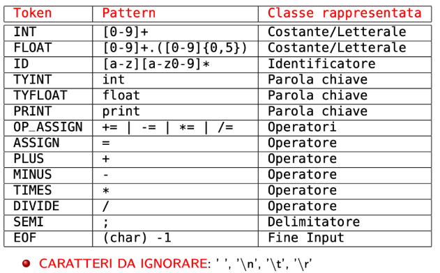
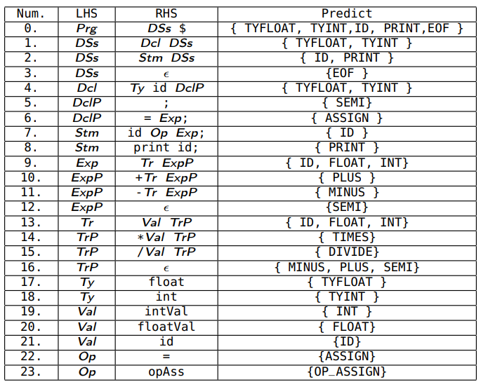

Lorenzo Mirto Bertoldo @climadd

AcDc Compiler
-------------
### Project Overview
This project is a compiler that translates Ac, a simple language with integer and floating-point support, into Dc, a stack-based calculator language using reverse Polish notation. The compiler processes Ac code through lexical, syntactic, and semantic analysis before generating Dc-compatible output.
Ac features basic arithmetic operations, variable declarations, and assignments, while Dc executes expressions using a stack-based approach. This compiler bridges the two, allowing Ac programs to be evaluated in Dc. More on [Dc Manual](https://www.gnu.org/software/bc/manual/dc-1.05/html_mono/dc.html).

Below is the installation guide to set up and run the project.

### Installation
This compiler was developed using **Java 17**, but it should run on any modern Java version. Before running the project, ensure that Java is installed on your system. You can follow this [installation guide](https://www.java.com/en/download/help/download_options.html) to set it up.

#### Setup Instructions:
- **Verify Java Installation**: Run `java -version` in the terminal to confirm Java is installed.
-  **Clone the Repository** (if applicable): Use `git clone <repo-link>` to download the project.
- **Compile the Source Code**: Navigate to the project directory and use `javac *.java` to compile all Java files.
- **Run the Compiler**: Execute the program through the various test classes and `.txt` files located in the `src/test/data` directory for the compilation.

## About the Compiler
Below is a structured breakdown of the key stages involved in the compilation process.

### 1. Lexical Analysis
The **Lexical Analysis** phase is performed by the `Scanner` class. This stage tokenizes the input stream, converting raw text into a sequence of meaningful tokens that represent the basic elements of the source code.

#### Token Structure:

        

   *Every Token and their structure. At the bottom list of Characters to be skipped.*

#### Finite State Automata for Token Recognition:
    *Scanner behaviour for Token recognition.*

### 2. Syntactic Analysis
Handled by the `Parser` class, the **Syntactic Analysis** phase processes the tokens produced in the lexical analysis. It constructs an **Abstract Syntax Tree (AST)**, which represents the hierarchical structure of the program.

#### Grammar Used by the Parser:
   *Context-free grammar rules for the Parsing process.*

#### Nodes in the AST (Output of the Parsing Process):
   *Structure and hierarchy of nodes within the AST.*

### 3. Semantic Analysis
The **Semantic Analysis** phase is executed by the `TypeCheckingVisitor` and its related classes. This phase ensures that the program adheres to type correctness and semantic rules. It involves visiting the AST and verifying the types of variables involved, ensuring the consistency of operations and declarations, and validating them through the use of the **Symbol Table**.

### 4. Code Generation
The final phase of compilation involves the **Code Generation** process. This is another visit to the AST, where the `CodeGenerationVisitor` class translates the AST's nodes contents into **Dc** code, producing the final executable output of the program.

#### Code Generation Example: Generating Dc code
   *Example of Ac to Dc translation.*
